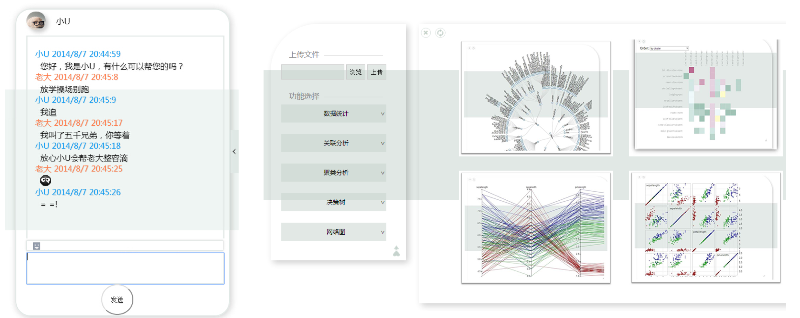

# Hackathon Bitrun 2018

This repository contains a list of decentralized applications, which are built during the 42h bitrun hackathon challenge by our bithackers. 

Disclaimer: Code implementations here are purely for educational purposes. In each project directory, there will be a README describing the technical details.

## Shanghai

### Contents

- [立个"FlAG"(A hostage to fortune)](https://github.com/AwesomeHuang/Shanghai-Hackthon-BitFly). Team BitFly members: Zhengjie Huang, Yan Chen.

|      |    Team    |   Member    |                  Project                   |
| ---- | :--------: | :---------: | :--------------------------------------: |
| 1    | BitFly | Zhengjie Huang, Yan Chen    | [立个"FlAG"](https://github.com/AwesomeHuang/Shanghai-Hackthon-BitFly) |
