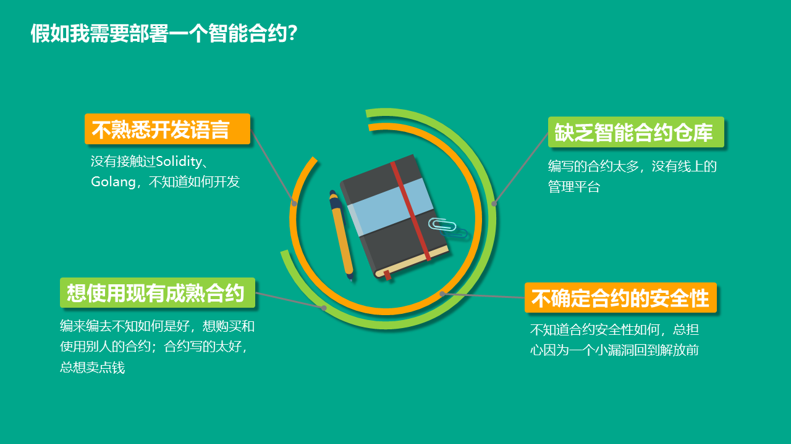
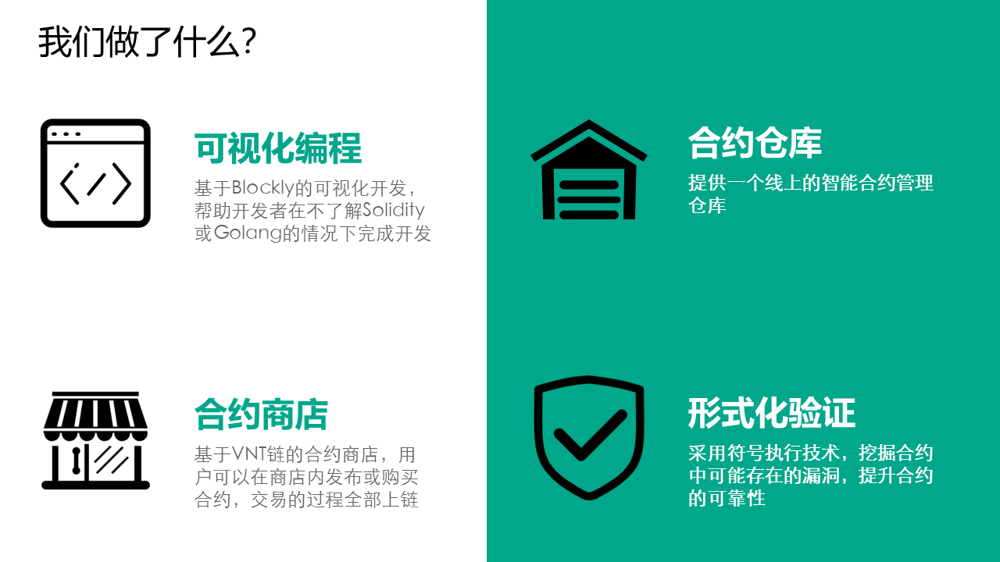
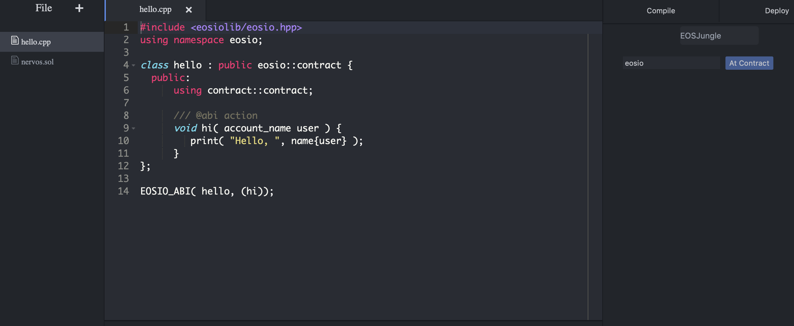
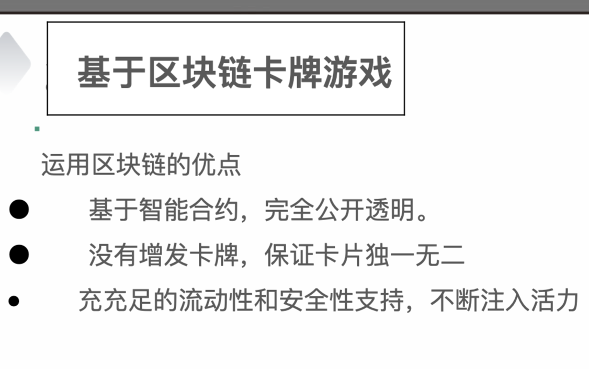
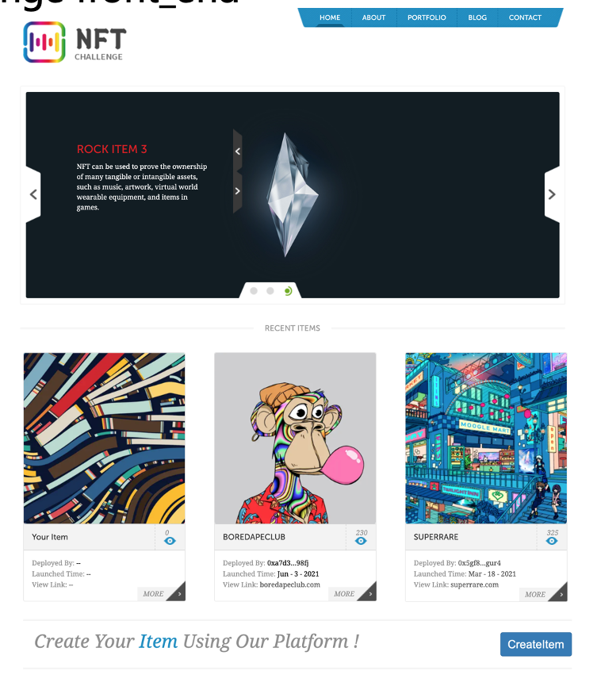

# Hackathon BitRun

This repository contains a list of decentralized applications, which are implemented by our bithackers during the 42h bitrun hackathon challenge. The dapps are maintained by their respective authors. 

Disclaimer: Code implementations here are purely for educational purposes. In each project directory, there will be a README describing the technical details.

## Hangzhou

- [Scoser - Interactive Smart Contract Online Building Platform](https://github.com/AwesomeHuang/Hangzhou-Hackthon-Incas). Team Incas members: Zhengjie Huang, Jianhai Chen, Jueyu Li, Xiaowen Xu, Jie Zhang.

  

- [ChainStudio - Integrated IDE and Tools for Ethereum, EOS and Nervos](https://github.com/wcy1231/Chain-Studio). Team PeaceLove members: Chaoyi Wu and Tianyao Gao

## Shanghai

- [立个“FlAG” (A Hostage to Fortune)](https://github.com/AwesomeHuang/Shanghai-Hackthon-BitFly). Team BitFly members: Zhengjie Huang, Yan Chen, Baobao Jia, Yan Wang, Linyi Qi.

  

- [A Trading Card Game based on ERC-721](https://github.com/COAOX/Tensor). Team Tensor members: Liang Xu, Renqian Zhang, Yiping Chen, Le Liu and Yu Cai.

  

## Near

- [NFTchallenge](https://github.com/mircial/NFTChallenge). A platform make nft easy created for projects, besides make all NFTs valuable.

 

