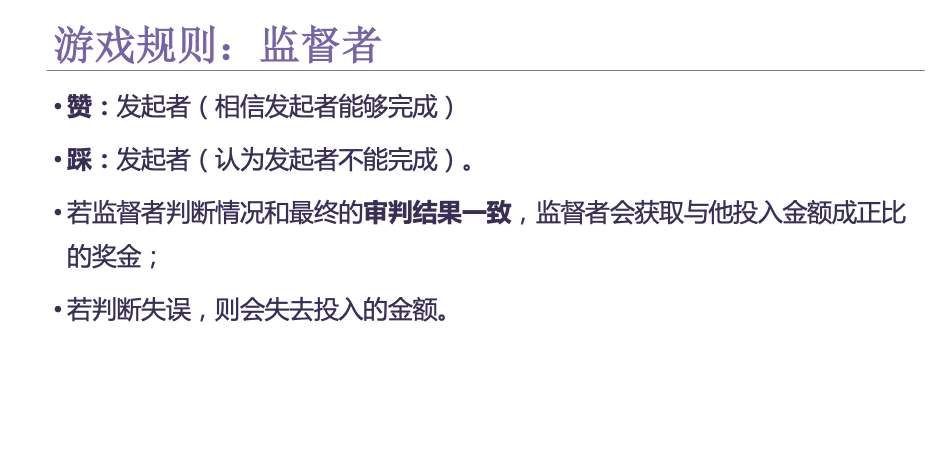
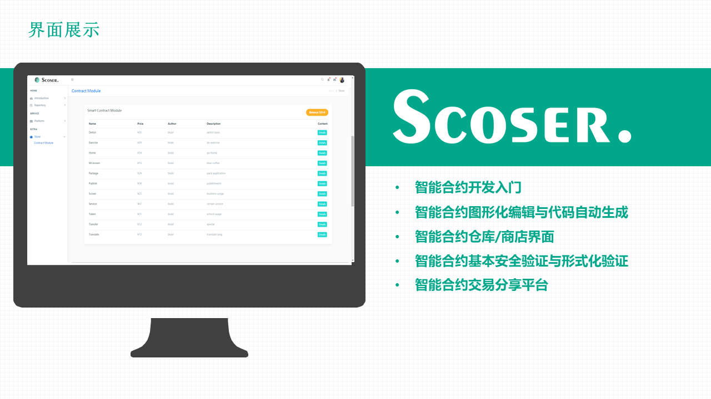

# Hackathon Bitrun 2018

This repository contains a list of decentralized applications, which are implemented by our bithackers during the 42h bitrun hackathon challenge. The dapps are maintained by their respective authors. 

Disclaimer: Code implementations here are purely for educational purposes. In each project directory, there will be a README describing the technical details.

## Shanghai

- [立个“FlAG” (A hostage to fortune)](https://github.com/AwesomeHuang/Shanghai-Hackthon-BitFly). Team BitFly members: Zhengjie Huang, Yan Chen, BaoBao Jia, Yan Wang, LinYi Qi.

 

 

 
 
 

 

 

 

## Hangzhou

- [Scoser 智能合约在线服务平台 (A hostage to fortune)](https://github.com/AwesomeHuang/Hangzhou-Hackthon-Incas). Team Incas members: Zhengjie Huang, Jianhai Chen, Jueyu Li, Xiaowen Xu, Jie Zhang.

 

 

 
 
 
